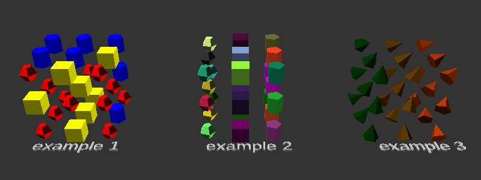

# OpenSCAD Utilities

This is yet another generic OpenSCAD library to help with creating meshes/objects/surfaces in OpenSCAD. Currently this library is mainly consumed by myself for some of my work in OpenSCAD. I've put some effort to generalize some of the modules/functions for reuse by anyone. Issues and PR are accepted!

## How to use

This project is broken down into a few individual files, all of which can be used independently. You can simply download the scad file(s) that you need for your project and include it via `use`. Below lists each file and the modules/functions it contains.

### Cloners

Most of the functionality in these functions mimics the cloner functionality found in Cinema4D.

#### Grid Array Cloner (grid_array_cloner)

Clones children objects in a 3D grid array. When using this module, you can access the `$i` or `$i_xyz` global variable which you can use to modify each clone object (see example #3 shown below).

##### Parameters

|Parameter name|Description|Default value|
|---|---|---|
|`count`|Number of clones per axis|`[1, 1, 1]`
|`size`|Distance between each clone|`[1, 1, 1]`
|`clones`|Either `"iterate"` or `"random"`. Controls how children will be cloned when using multiple children|`"iterate"`
|`seed`|Seed value used for random child selection (when using `"random"` clones mode)|`123456`

##### Examples



```openscad
use <cloners.scad>
use <random.scad>

// example 1
grid_array_cloner(size = [2, 2, 2], count = [3, 3, 3], clones = "random") {
    color("Red") sphere(r = .5, center = true);
    color("Yellow") cube([1, 1, 1], center = true);
    color("Blue") cylinder(r = .5, h = 1, center = true);
}
translate([0, -2, 0]) linear_extrude(height = .1) text("example 1", size = .8);

// ...
```

[View source for other examples](examples/grid_array_cloner.scad)

#### Radial Cloner (radial_cloner)

Clones children objects along a circle. When using this module, you can access the `$i` global variable which you can use to modify each clone object (see example #2 shown below).

##### Parameters

|Parameter name|Description|Default value|
|---|---|---|
|`count`|Number of clones|`1`
|`r`|Radius of circle to clone around|`1`
|`start`|Angle of circle to begin cloning around|`0`
|`end`|Angle of circle to end cloning around|`360`
|`align`|Whether or not to rotate the child along the circle|`true`
|`clones`|Either `"iterate"` or `"random"`. Controls how children will be cloned when using multiple children|`"iterate"`
|`seed`|Seed value used for random child selection (when using `"random"` clones mode)|`123456`

##### Examples

```openscad
use <../cloners.scad>
use <../random.scad>

// example 1
radial_cloner(count = 6, r = 3, clones = "random") {
    color("Red") sphere(r = .5, center = true);
    color("Yellow") cube([1, 1, 1], center = true);
    color("Blue") cylinder(r = .5, h = 1, center = true);
}
translate([0, -2, 0]) linear_extrude(height = .1) text("example 1", size = .8);

// ...
```


[View source for other examples](examples/radial_cloner.scad)

#### Linear Cloner (linear_cloner)

Similar to the grid array cloner except this only works in one direction. When using this module, you can access the `$i` global variable which you can use to modify each clone object.

##### Parameters

|Parameter name|Description|Default value|
|---|---|---|
|`count`|Number of clones|`1`
|`size`|Distance between each clone|`[0, 0, 1]`
|`clones`|Either `"iterate"` or `"random"`. Controls how children will be cloned when using multiple children|`"iterate"`
|`seed`|Seed value used for random child selection (when using `"random"` clones mode)|`123456`

##### Examples

TODO

#### Vertex Cloner (vertex_cloner)

##### Parameters

|Parameter name|Description|Default value|
|---|---|---|
|`points`|Array of coordinates in space to clone children on to|`[]`
|`clones`|Either `"iterate"` or `"random"`. Controls how children will be cloned when using multiple children|`"iterate"`
|`seed`|Seed value used for random child selection (when using `"random"` clones mode)|`123456`

##### Examples

TODO

### Random

Various functions to generate random numbers, vectors, and matrices.

#### Random Double (rand_double)

Returns a double between two numbers (inclusive).

##### Parameters

|Parameter name|Description|Default value|
|---|---|---|
|`low`|Min value|`0`
|`high`|Max value|`1`
|`seed`|Seed value used for random number generation|`123456`

##### Examples

```openscad
use <../random.scad>

translate([rand_double() * 2, rand_double(0, 2), 0]) sphere(size = [2, 2], center = true)
```

#### Random Color (rand_color)

Returns an array of RGBA values that can be passed to `color()`. When defining contraints you will want to stay within [0,1] since values are defined as a floating point number.

##### Parameters

|Parameter name|Description|Default value|
|---|---|---|
|`constrain`|Define min and max values for each color channel. The first element defines min values for RGB respectively. The second element defines max values for RGB respectively.|`[[0,0,0], [1,1,1]]`
|`alpha`|Define the alpha value of the color. This is not randomly defined.|`1`
|`seed`|Seed value used for random number generation|`123456`

##### Examples

```openscad
use <../random.scad>

color(rand_color()) sphere(size = [2,2], center = true);

color(rand_color(constrain = [[.5, .5, .5], [1, 1, 1]])) sphere(size = [2, 2], center = true);
```